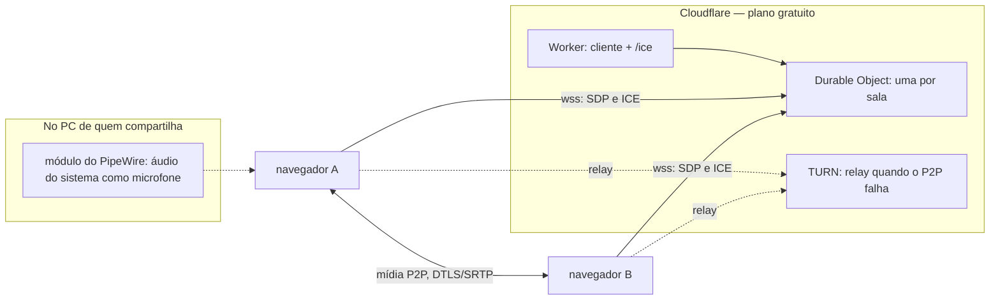

# Disgalm — Plano de PoC

Compartilhamento de tela + áudio entre 4 amigos, via WebRTC, feito em uma noite.

## Decisões já fechadas

| Decisão | Escolha | Consequência |
|---|---|---|
| Topologia | Mesh P2P, N↔N, 4 pessoas | 3 PeerConnections por pessoa. Sem SFU. |
| Rede | Linux com IP público / port-forward | coturn viável no próprio servidor. |
| Navegador | Chrome/Edge obrigatório | Firefox não captura áudio de sistema em SO nenhum. |
| Captura | Nativa do navegador | OBS fica como plano B, não entra no caminho principal. |

## Estado medido da máquina (`marucs-note`, 2026-08-17)

- KDE Plasma sobre **Wayland**, `xdg-desktop-portal-kde` instalado.
- **PipeWire** com `pipewire-pulse`. Sink ativo: `alsa_output.pci-0000_0f_00.6.analog-stereo`.
- **OBS Studio 32.1.2** (tem saída WHIP nativa) — reserva.
- node/pnpm e python3 disponíveis.
- **Só Firefox instalado.** Sem Chrome/Chromium.
- **coturn não instalado.**

Tudo o mais sobre comportamento de navegador neste documento é **hipótese**, não medição. Cada PoC existe para falsificá-la.

## O gargalo real

Captura de **vídeo** é trivial nos dois SOs. O que pode derrubar a noite é outra coisa:

- **Windows + Chrome/Edge:** `getDisplayMedia({video:true, audio:true})` oferece "compartilhar áudio do sistema" na aba *Tela inteira*. Nativo.
- **Linux + qualquer navegador:** áudio de tela no `getDisplayMedia` **não existe**. Chrome captura áudio só de *aba*.
- **Contorno:** expor o monitor do PipeWire como se fosse microfone, e pegar por `getUserMedia`.

Isso permite um código só, sem detectar plataforma:

```js
const display = await navigator.mediaDevices.getDisplayMedia({ video: true, audio: true })
if (display.getAudioTracks().length === 0) {
  // Linux: áudio vem do loopback do PipeWire
  const loop = await navigator.mediaDevices.getUserMedia({
    audio: { deviceId: LOOPBACK_ID, echoCancellation: false, noiseSuppression: false, autoGainControl: false },
  })
  display.addTrack(loop.getAudioTracks()[0])
}
```

## Conta de banda — precisa caber no plano, não ser descoberta às 3h

Áudio é barato: Opus estéreo 128 kbps × 3 pares ≈ **384 kbps de subida**. Irrelevante.

Vídeo não. Screenshare com **código legível** pede ~2,5–4 Mbps. Em mesh, cada pessoa envia sua tela para os outros 3:

| Cenário | Subida por pessoa |
|---|---|
| 1 tela compartilhada por vez | 2,5–4 Mbps |
| 4 telas simultâneas | **7,5–12 Mbps** |

**Regra adotada:** `maxBitrate` travado em ~2,5 Mbps por sender de vídeo, e **um screenshare ativo por vez** (áudio dos 4 sempre ligado). Quatro telas simultâneas não é ajuste de parâmetro — é trocar mesh por SFU, e isso não cabe na noite.

No coturn: relay só entra quando o P2P direto falha. No pior caso (NAT simétrico de alguém), **todo o tráfego passa pelo seu link**. O PoC 4 mede isso; não supor.

## Roteiro

Ordenado por risco: o que pode matar o projeto vem antes de qualquer linha do app.

### Passo 0 — Chromium na máquina (5 min)

Sem navegador Chromium não se testa nada do caminho escolhido.

```bash
sudo pacman -S chromium
```

### PoC 1 — Áudio do desktop no Linux (45 min) — MAIOR RISCO

```bash
pactl load-module module-remap-source \
  master=alsa_output.pci-0000_0f_00.6.analog-stereo.monitor \
  source_name=webrtc_loopback \
  source_properties=device.description=WebRTC_Loopback
```

Validar em duas camadas separadas:

1. **PipeWire** — `parecord` do `webrtc_loopback` com música tocando; conferir que o arquivo tem estéreo e nível de sinal.
2. **Navegador** — `enumerateDevices()` deve listar `WebRTC_Loopback`; `getUserMedia` nele com `echoCancellation`, `noiseSuppression` e `autoGainControl` **todos em `false`**. Com esses filtros ligados, música vira lixo — é o erro clássico deste caminho.

**Fecha com:** 10s gravados e reproduzidos, música reconhecível, estéreo, sem cortes.
**Mata o PoC se:** o device não aparecer no navegador, ou vier mono/cortado mesmo com os filtros desligados.
**Plano B:** sink virtual do OBS.

### PoC 2 — Captura de tela no Wayland/KDE (20 min)

`getDisplayMedia({video:true})` → diálogo do portal do KDE → `<video>` local exibindo.

Responder: janela única funciona ou só tela inteira? O cursor aparece? O Chromium precisou de flag (`--ozone-platform=wayland`)?

**Mata o PoC se:** nada além de tela inteira funcionar — dá para viver com isso, mas muda a UX.

### PoC 3 — Windows (20 min)

`getDisplayMedia({video:true, audio:true})`, marcando "compartilhar áudio do sistema" na aba *Tela inteira*.

Não basta a track existir: medir energia com `AnalyserNode` para provar que não vem muda.

### PoC 4 — coturn (45 min)

Instalar, credencial estática de longo prazo (suficiente para uso entre amigos), abrir `3478/udp`, `3478/tcp` e o range `49152-65535/udp`.

1. Página `trickle-ice` do WebRTC: precisa aparecer candidato `typ relay`.
2. **Forçar `iceTransportPolicy: 'relay'` e conectar de fato.** O candidato sozinho não prova que o relay funciona.
3. Medir Mbps no link durante o teste.

### PoC 5 — Sinalização + mesh (60 min)

Servidor WS em node: sala por código, relay de SDP/ICE, *perfect negotiation*. Validar com 2 peers, depois subir para 4.

### PoC 6 — Qualidade (45 min)

- Vídeo: `videoTrack.contentHint = 'detail'`, framerate baixo e bitrate alto (texto legível vale mais que fluidez).
- Áudio: `audioTrack.contentHint = 'music'` e Opus com `stereo=1;sprop-stereo=1;maxaveragebitrate=128000` no SDP.

Sem isso o app "funciona" e é ruim de usar.

## UI (0.2.0, baseada no Discord)

- **Palco + tira**, clicar num tile promove ao palco. Grade uniforme daria 1/4 da área ao que importa.
- **Volume separado por pessoa: voz e tela.** O Discord tem um só. Saiu quase de graça porque as tracks já estavam em elementos distintos desde a correção do bug de áudio, e resolve o caso real: abaixar o jogo sem perder a voz.
- **Badges `LIVE` e `sem áudio`** no tile e no palco. O segundo nasce do caso do enzo: sem ele o erro é invisível para os dois lados.
- Anel verde de quem fala, tela cheia, PiP, ensurdecer, mudo.
- O receptor não distingue voz de tela olhando a track, então **quem compartilha anuncia o `streamId` da tela** pelo canal de sinalização. O mesmo anúncio alimenta os badges.

### Qualidade da própria tela

Presets (Código 1080p5 · Equilíbrio 1080p30 · Jogo 1440p60 · Máximo 4K60) e modo manual com resolução, fps e bitrate independentes.

**O bitrate anda junto com resolução e fps de propósito.** 4K60 num teto de 2,5 Mbps fica *pior* que 1080p30: os mesmos bits espalhados por 4× mais pixels e 2× mais quadros. Deixar o teto fixo transformaria o controle numa armadilha.

**A conta de 4K60 em malha não fecha em link residencial:**

| Preset | Por par | Com 3 pares |
|---|---|---|
| Código | 1,5 Mbps | 4,5 Mbps |
| Equilíbrio | 4 Mbps | 12 Mbps |
| Jogo 1440p60 | 12 Mbps | **36 Mbps** |
| Máximo 4K60 | 25 Mbps | **75 Mbps** |

A UI mostra o custo estimado de subida ao vivo, e reporta **pedido vs obtido** — a captura não entrega 4K se o monitor não for 4K, e nesse caso o número escolhido é ficção. Escolha do Marcus, com o número à vista.

`contentHint` passou a seguir o preset: `detail` só até 10 fps (ler código), `motion` acima. Foi o `detail` fixo que deixou tela de jogo parecendo travada.

## Medição: Durable Object no plano gratuito (2026-08-17)

Pergunta: a sinalização cabe no limite gratuito da Cloudflare (13.000 GB-s/dia)?

Duas classes de DO idênticas, diferindo só em como aceitam o WebSocket. **1 minuto de conexão em cada**, sem tráfego (ping desligado, que é o que uma sala parada faz de verdade).

| | `SalaHibernada` | `SalaViva` |
|---|---|---|
| Aceita com | `ctx.acceptWebSocket()` | `servidor.accept()` |
| **Billable duration** | **0,02 GB-s** | **48,63 GB-s** |
| WebSocket inbound | 6 *hibernatable* | 4 *non-hibernatable* |
| Memória de pico | 983 kB | 786 kB |

**~2.400× de diferença** para o mesmo trabalho. A classificação `hibernatable` / `non-hibernatable` vem do próprio runtime, então é confirmação da plataforma e não inferência a partir do número.

**Conclusão:** cabe no plano gratuito com folga, **desde que use hibernação**. Sem ela, ~1.380 GB-s por call de 3h, ou seja teto de ~9 calls/dia. Com ela, ruído.

**Achado não previsto:** o gráfico do `SalaViva` continua gerando picos às 20:40 e 20:45, depois de os testes terminarem por volta de 20:35. 1 minuto de conexão produziu ~48 GB-s, equivalente a ~6 minutos de residência. O modo não-hibernante **continua cobrando depois que o cliente foi embora**.

**O que isto decide:** que a Cloudflare é viável e gratuita para a sinalização, e que hibernação é obrigatória e não opcional. **O que não decide:** se vale migrar — o Funnel funciona hoje e subir o `server.js` num host não custa reescrita nenhuma. O PoC comprou o número, não a decisão.

Os "Errors" (2 e 3) são desconexão de cliente, não falha; no `SalaViva` o detalhamento mostra `Client disconnected 2`. No `SalaHibernada` o contador diz 2 mas o detalhamento está zerado — atraso de categorização, **não verificado**.

### Segunda rodada, ~8 min (pendente de leitura)

Os números acima são da janela de **1 minuto (~20:30–20:40)**. Depois deles rodou uma segunda leva de **7:56 em cada modo**, então o acumulado do dia soma as duas. Ao analisar, filtrar por janela ou tratar como ponto independente — não comparar contra a tabela acima sem separar.

Previsão registrada antes de olhar, para servir de teste:

| | Esperado |
|---|---|
| `SalaViva` | 61 GB-s de tempo de parede, mais a cauda pós-desconexão observada na 1ª rodada → algo entre **61 e 90 GB-s** |
| `SalaHibernada` | continuar em **ruído**, na casa de centésimos |

Se o `SalaHibernada` crescer proporcional ao tempo conectado, a conclusão da 1ª rodada cai e a hibernação não estaria funcionando como medido.

**Resultado (acumulado do painel, descontando a 1ª rodada):**

| | 1ª rodada | Acumulado | Incremento dos ~8 min |
|---|---|---|---|
| `SalaHibernada` | 0,02 | 0,04 | **+0,02 GB-s** |
| `SalaViva` | 48,63 | 81,56 | **+32,93 GB-s** |

A previsão do `SalaHibernada` acertou. **A do `SalaViva` errou:** previ 61–90 GB-s e vieram 33. O modelo supunha residência contínua a 128 MB (476 s × 0,128 = 61); os 33 medidos implicam ~257 s residentes, cerca de metade do tempo conectado. Ou o objeto não-hibernante também é descarregado às vezes, ou a duração cobrada não é tempo de parede puro — **não determinado**.

Razão hibernada/viva: ~2.400× na 1ª rodada, ~1.600× na 2ª, ~2.000× no acumulado. A conclusão sobrevive a qualquer recorte, e agora está apoiada em duas durações diferentes em vez de uma.

## Defeitos encontrados em uso real

Todos da **mesma raiz**, que eu tratei como três casos isolados antes de perceber: um elemento `<video>`/`<audio>` reproduz **apenas a primeira track de cada tipo** do `MediaStream`. Acumular tracks não dá erro — dá silêncio ou quadro congelado.

| Sintoma | Causa | Situação |
|---|---|---|
| Tela do amigo sem áudio | Ele mandou só o mic. No Chrome/Windows o "compartilhar áudio do sistema" só existe em **Tela inteira** ou **Guia**, nunca em janela, e vem **desmarcado**. | não é bug — é operação |
| Áudio do sistema não tocava mesmo quando enviado | mic + sistema no mesmo `<video>` → só o primeiro tocava | corrigido: uma track por `<audio>` |
| Recompartilhar trava num quadro estático | Nova track de vídeo chega, a antiga (morta) continua sendo a primeira do stream e o elemento segue exibindo o último quadro dela | corrigido: descartar as anteriores |
| Vídeo travado com áudio bom | Suspeita: `contentHint='detail'` manda o encoder sacrificar quadros para preservar resolução. Ótimo para ler código, péssimo para assistir jogo. | **não confirmado** — instrumentado com fps/kbps/freezes |

**Conhecido e não corrigido:** cada ciclo de compartilhar/parar usa `removeTrack` + `addTrack`, o que renegocia e aparentemente deixa transceiver morto (o `ontrack` remoto dispara de novo a cada ciclo). O SDP cresce a cada rodada. O certo é `replaceTrack`, que dispensa renegociação.

## Arquitetura (0.4.0)

Tudo na Cloudflare, exceto o que não pode sair da máquina.



**Nada entra na máquina.** Sem port-forward, sem coturn, sem Funnel, sem processo. Sobrou o módulo do PipeWire, que é local por natureza: captura de áudio do sistema não tem versão em nuvem. Ele morre no reboot e o `loopback.sh` recria.

**O Worker nunca vê mídia** — só repassa SDP e ICE. Já o TURN vê tudo, e por isso a conta de banda dele é a que importa: 1 TB grátis por mês, ~165 h no preset Equilíbrio e ~29 h no 4K60.

**As credenciais do TURN são efêmeras.** O Worker chama a API da Cloudflare a cada `/ice` e devolve usuário e senha temporários; o par (key id, api token) fica em secrets e **nunca chega ao navegador**. É melhor que o coturn, onde a senha estática ia na página e ficava com quem a abrisse.

### O que a noite provou e o que derrubou

| Decisão inicial | Como terminou |
|---|---|
| IP público e port-forward em casa | **desnecessários** — nada entra na máquina |
| coturn próprio | substituído; nunca passou de teste com hairpin |
| Mesh P2P para 4 | mantida; o teto é a subida de quem compartilha |
| Chrome/Edge obrigatório | mantida; Firefox não capta áudio de sistema |
| Captura nativa do navegador | mantida; OBS nunca foi necessário |

O relay externo só foi **provado** com o TURN da Cloudflare, forçando `iceTransportPolicy: 'relay'` entre duas redes. O coturn passou a noite inteira sem essa prova.

### Detalhes que custaram tempo

**Um cliente, dois backends.** Sala e nome vão na URL porque o Worker precisa deles **antes** do upgrade, para escolher a Durable Object; o `server.js` local ignora a query e usa a mensagem `join`, que o Worker por sua vez ignora. O mesmo `public/index.html` roda nos dois.

**`public/` contém só cliente.** Assets do Worker são publicados na web: apontá-los para um diretório com `cert.pem` e `turn.env` dentro publicaria a chave privada por URL. Os segredos ficam em `local/`, e o `.gitignore` não protegeria nada aqui — o wrangler lê disco, não git.

**Um elemento de mídia reproduz só a primeira track de cada tipo.** Foi a raiz de quatro defeitos distintos. Voz e áudio do sistema, tela e câmera: cada um precisa do seu elemento, e o emissor anuncia o `streamId` de cada fonte porque o receptor não distingue olhando a track.

**`removeTrack` no emissor não encerra a track no receptor** — ela só fica muda, `ended` nunca dispara, e o `<video>` congela no último quadro. Por isso o anúncio é a fonte da verdade: track cujo `streamId` sumiu do anúncio está morta.

**Duas armadilhas de ambiente:** `node:22-alpine` é musl e o `workerd` é glibc, então `wrangler dev` morre com ENOENT; e rodar o container com `-u $(id -u)` faz o `workerd` **pendurar sem erro nenhum** em vez de reclamar de permissão.

## Entregável

Sem framework e **sem uma única dependência** — o `pnpm` da máquina está quebrado, o que empurrou para built-ins do Node e deixou o app menor.

- `poc/app.html` — cliente (mesh, negociação perfeita, Opus estéreo, fallback de áudio)
- `poc/captura.html` — banco de teste dos PoC 1 e 2, com veredito automático
- `server.js` — sinalização + estáticos + `/ice`; HTTPS quando há certificado
- `loopback.sh` — áudio do sistema como microfone, no Linux
- `poc/local/` — certificado, chave e credenciais do TURN. **Fora do git.**

Subir: `./loopback.sh && node server.js` → `https://localhost:8444/`

## Portas no modem — nenhuma (desde 2026-08-18)

Todos os port-forwards foram fechados. Nada entra na máquina.

| Porta | Era para | Por que saiu |
|---|---|---|
| `3478/udp`, `3478/tcp` | coturn | relay passou para a Cloudflare |
| `49160-49200/udp` | faixa de relay do coturn | idem |
| `443/tcp` | o app | substituído pelo Worker |

Fechar isto **não afeta o P2P**: WebRTC atravessa NAT por hole-punching com STUN e nunca precisou de forward. Os forwards existiam porque o coturn era um servidor aguardando conexão de entrada.

Para voltar ao coturn seria preciso reabrir essas portas **e** corrigir o `external-ip` do `turnserver.conf`, que tem o IP residencial literal e provavelmente já mudou.

## Achados

Preencher ao fechar cada PoC. Registrar o que foi **executado**, não o que foi lido.

| PoC | Status | Achado |
|---|---|---|
| 0 Chromium | **bloqueado** | `pacman -S chromium` falha com 404 em todos os mirrors: banco de pacotes local desatualizado (pede a 150.0.7871.186, mirrors já passaram dela). Exige `pacman -Syu` completo — upgrade parcial quebra Arch. Decisão do Marcus, não feito. |
| 1 Áudio Linux — PipeWire | **passou (medido)** | `module-remap-source` sobre o monitor do sink → `webrtc_loopback`, float32le 2ch 48kHz. Tom 440 Hz L / 880 Hz R gravado com `parecord`: pico correto em cada canal, correlação L/R = 0.0 → **estéreo real, sem downmix**. Ganho unitário (origem −21,1 dBFS, gravado −21,1 dBFS). |
| 1 Áudio Linux — pré-volume | **passou (medido)** | Sink a 87% → −21,1 dBFS; a 30% → −21,1 dBFS; **mudo** → −19,8 dBFS. O tap é **pré-volume e pré-mute**: o usuário pode baixar ou mutar os próprios alto-falantes e o áudio continua indo íntegro para o stream. Volume restaurado a 87%. |
| 1 Áudio Linux — constraints | **passou (Firefox)** | `WebRTC_Loopback` visível no `enumerateDevices()`. `track.getSettings()`: `echoCancellation: false`, `noiseSuppression: false`, `autoGainControl: false`, `channelCount: 2`. O Firefox **respeitou** os três filtros — era o risco principal do caminho. |
| 1 Áudio Linux — sinal | **passou (medido)** | Com o tom de teste: `AudioContext: running`, L = 439 Hz, R = 879 Hz, **−21,1 dBFS nos dois canais — o mesmo valor medido pelo `parecord` fora do navegador**. Ganho unitário confirmado também pelo caminho do browser, estéreo preservado ponta a ponta. A leitura anterior de −240 dBFS era ausência de áudio tocando, não defeito. |
| 2 Tela Wayland | **passou (Firefox)** | Portal do KDE OK. `1920x1080 @ 30fps`, `resizeMode: crop-and-scale`, label `Primary Monitor`. `getDisplayMedia` **não trouxe track de áudio**, como previsto no Linux → o loopback do PoC 1 é obrigatório. Para o PoC 6: 30fps a 1080p é o oposto do que serve para código legível; baixar fps e subir bitrate. |
| 3 Windows | **passou (uso real)** | Áudio de sistema do Windows chegou e tocou (par "oi"). O caso do "enzo" — sem áudio — era **operacional**: no Chrome/Windows o "compartilhar áudio do sistema" só existe em **Tela inteira** ou **Guia**, nunca em janela, e vem desmarcado. Confirma a hipótese A e descarta defeito de plataforma. Implicação de produto: a UI precisa avisar quando o par compartilha **sem** track de áudio, senão o erro é invisível para os dois lados. |
| 4 coturn — servidor | **passou (medido)** | Rodando em Docker (`disgalm-turn`, `--network host`), **sem depender do `pacman`**. `turnutils_uclient` pelo IP da LAN: 16 msgs enviadas, 16 recebidas, **0 perdidas**, jitter 0,06 ms — alocação + permission + channel data confirmados. Config e credenciais em `poc/local/` (fora do git). O 403 pelo loopback é esperado com `external-ip` mapeado, não é falha. |
| 4 coturn — externo | **parcial** | Antes do forward: `Connection refused`. Depois: 16/16, 0 perdidos, RTT 1,6 ms. Mas **1,6 ms é baixo demais para ter trafegado pela internet** — é hairpin do roteador. Isso prova que a porta está mapeada, **não** que um peer externo alcança. Fecha só com teste de fora da LAN (celular em 4G). |
| — contexto seguro | **resolvido para teste** | `server.js` sobe em **HTTPS na 8444** quando `poc/local/cert.pem` e `key.pem` existem, e cai para HTTP avisando quando não. Certificado autoassinado com SAN para `localhost`, LAN, tailnet e IP público. Bateria de sinalização revalidada **sobre WSS: 9/9**. A 8443 estava ocupada pelo **Tailscale** nesta máquina. |
| — TLS definitivo | **resolvido (medido)** | **Tailscale Funnel** em `https://<host>.ts.net:10000/` → `https+insecure://127.0.0.1:8444`. Certificado **Let's Encrypt válido** (`ssl_verify_result=0`), sem aviso. Sem domínio comprado, sem port-forward para o app, e imune à troca do IP dinâmico. Funnel só aceita 443/8443/10000; as duas primeiras já eram usadas pelo `tailscale serve` da máquina, daí a 10000. |
| — TLS pelo caminho público | **passou (medido)** | Cuidado que quase passou batido: MagicDNS resolve o host para `<ip-do-tailnet>` **de dentro do tailnet**, então o primeiro 9/9 foi pelo tailnet, não pelo Funnel. Forçando o ingress público (`209.177.145.97`, o que o DNS público devolve): HTTPS 200 com cert válido, e upgrade de WebSocket devolvendo **`101 Switching Protocols`** com o `Sec-Websocket-Accept` correto do RFC 6455. Mesmo erro estrutural do hairpin NAT — testar de dentro não prova nada sobre quem está de fora. |
| — exposição pública | **nota** | A sala agora está na internet aberta e o código de sala é o único controle de acesso. `galm` é adivinhável. Para 4 amigos tanto faz; se incomodar, gerar código aleatório. |
| — IP dinâmico | **risco aberto** | `external-ip` no `turnserver.conf` tem IP literal. Quando o IP residencial mudar, o sintoma é "conecta mas sem mídia". Re-renderizar o config na troca. |
| — Tailscale | **oportunidade** | `tailscaled` na 41641/udp. O tailnet já tem `marucs-desktop` (**Windows**) e um Mac conectado **direct por IPv6** → o PoC 3 pode rodar sem abrir porta nenhuma. |
| 5 Sinalização — servidor | **passou (medido)** | `server.js`, **zero dependências** (WebSocket na mão sobre os built-ins — o `pnpm` da máquina está quebrado com `MODULE_NOT_FOUND`, e isso acabou favorecendo o app menor). Bateria de 9 testes sem navegador: 2 peers se acham, relay de 50 B / 200 B / 70 KB / 200 KB (as três faixas de header do RFC 6455), 5º peer recusado, saída propaga. 9/9. |
| 5 Sinalização — mesh | **passou (Marcus)** | 2 clientes, tela e microfone funcionando nos dois sentidos. Escopo do que isso prova: negociação perfeita, troca de SDP/ICE, `getDisplayMedia` e mic sobre WebRTC. **Não prova** TURN, NAT nem rede real — os dois peers estavam na mesma máquina, então o ICE resolveu por candidato host e nunca saiu do loopback. |
| 5 mesh — áudio do sistema | pendente | O teste usou o **microfone**. O loopback do PipeWire foi provado até o navegador (PoC 1) mas **nunca atravessou o WebRTC**: falta verificar se o estéreo sobrevive ao Opus. `app.html` agora mede o áudio **recebido** por canal (dBFS + frequência de pico na legenda de cada par), então o teste é objetivo: tocar o tom 440/880 no loopback de um lado e ler L/R do outro. |
| 6 Qualidade — Opus | **passou (medido)** | `opusEstereo()` injeta `stereo=1;sprop-stereo=1;maxaveragebitrate=128000;useinbandfec=1` no SDP. Exigiu trocar o `setLocalDescription()` sem argumento da negociação perfeita por `createOffer`/`createAnswer` + munge. 7 testes unitários: fmtp existente, fmtp ausente, CRLF, idempotência (renegociação repassa no mesmo SDP), múltiplos payload types opus, e não tocar em não-opus. 7/7. |
| 6 Qualidade — vídeo | parcial | 10 fps no `getDisplayMedia`, `maxBitrate` 2,5 Mbps, `contentHint` `detail`/`music`. **Falta verificar com tela e música reais** se texto fica legível e a música não degrada. |
| — loopback.sh | **passou (medido)** | Idempotente, e resolve o sink padrão via `pactl get-default-sink` em vez de fixar o nome — muda ao plugar fone ou dock. Testado descarregando o módulo e recriando do zero. |
